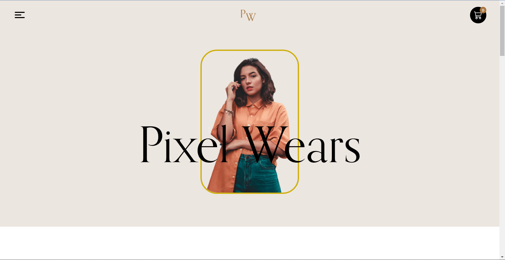

# Pixel Wears

This is an e commerce project, Built with React Js.
Animation is done with Framer motion and Global State Management is handled with framer motion

[Pixel Wears](https://pixel-wears.vercel.app/)

## Screenshot of Dashboard

## Tech Used
* React Js V18
* React Router v6
* Styled Components
* Redux Toolkit
* React Icons Package

## Lessons Learned
* I learned how to use Redux Toolkit for Global State management
* I learned how to write code to handle operations

## Future Release
This project need very good refactoring and restructuring. 
I'll need to separate constants and data into seperate files

## Setting Up
### npm install
To install the dependencies from the package.json

### npm start
TO start the application in localhost
